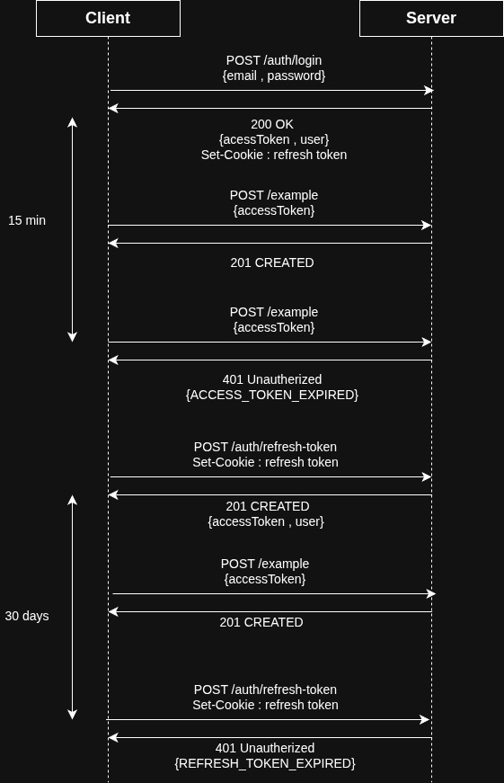

# MERN Booking App

A full-stack hotel booking application built with the MERN stack (MongoDB, Express, React, Node.js).

## Tech Stack

| Layer    | Technology                                                                    |
| -------- | ----------------------------------------------------------------------------- |
| Frontend | React 19, Vite, TypeScript , Shadcn UI, React Router , TanStack Query, Zustand       |
| Backend  | Express 5, Mongoose 9 , MongoDB, TypeScript                                             |
| Shared   | Zod schemas, error codes, ApiError , and types used by both frontend and backend         |

## Project Structure

```
mern-booking-app/
├── backend/              # Express API server
│   └── src/
│       ├── conf/         # Env parsing, MongoDB connection
│       ├── controllers/  # Request handlers
│       ├── helpers/      # Some utilities
│       ├── middlewares/   # Auth, validation, error handler
│       ├── models/       # Mongoose models
│       ├── routes/       # Route definitions
│       ├── services/     # Business logic
│       └── types/        # Some specific backend  type definitions
├── frontend/             # React SPA
│   └── src/
│       ├── api/          # API client functions + fetch wrapper
│       ├── components/   # UI components (shadcn-based + some custom components)
│       ├── hooks/        # Custom  hooks + 
│       ├── pages/        # Route pages
│       └── store/        # Zustand Stores
└── shared/               # Shared code
    ├── consts/           # Error codes, roles
    ├── schemes/          # Zod validation schemas
    └── utils/            # ApiError, ApiResponse types
```

## Getting Started

### Prerequisites

- Node.js 18+
- MongoDB instance (local or Atlas)
- Mailtrap account (for email testing)

### Installation

```bash
# 1. Install dependencies for all packages
cd backend && npm install
cd ../frontend && npm install
cd ../shared && npm install

# 2. Set up environment variables
cp backend/.env.example backend/.env
```

### Running the App

```bash
# Terminal 1 - Backend
cd backend && npm run dev

# Terminal 2 - Frontend
cd frontend && npm run dev
```

The API runs on `http://localhost:5000` and the frontend on `http://localhost:5173`.

---

## Authentication System

The auth system uses **access + refresh token rotation** with httpOnly cookies.

### Auth Flow
When a user logs in, the server will generate two JWTs: accessToken and refreshToken. Both JWTs are sent back the refreshToken is set as an httpOnly cookie and the accessToken is returned in the response body with the user info. The accessToken is short-lived (15 minutes) and is passed on EVERY request on the authorization header to authenticate the user. The refreshToken is long-lived (30 days) and is ONLY sent to the /refresh endpoint. This endpoint is used to generate a new accessToken, which will then be passed on subsequent requests.

The frontend has logic that checks for 401 ACCESS_TOKEN_EXPIRED errors. When this error occurs, the frontend will send a request to the /refresh endpoint to get a new accessToken. If that returns a 200 (meaning a new accessToken was issued), the auth store gets updated and the client will retry the original request with the new accessToken. This gives the user a seamless experience without having to log in again. If the /refresh returns a 401 REFRESH_TOKEN_EXPIRED, the user will be logged out and redirected to the login page.



### Auth Routes

| Method | Endpoint                  | Description                        |
| ------ | ------------------------- | ---------------------------------- |
| POST   | `/api/auth/register`      | Create account + return tokens + user info     |
| POST   | `/api/auth/login`         | Authenticate + return tokens + user info       |
| POST   | `/api/auth/refresh-token` | Exchange refresh token for a new access token + return user info  |
| POST   | `/api/auth/logout`        | Invalidate refresh token           |
| POST   | `/api/auth/forget-password` | Send password reset email + token       |
| POST   | `/api/auth/reset-password` | Reset password with token        |
| GET    | `/api/`                   | Protected root (requires AT)       |

### Frontend Auth State

- **Zustand store** (`frontend/src/store/userStore.ts`) — Holds `{ user, accessToken }` in memory.
- **Layout** — Renders at the root level, accessible to all pages. On mount, tries to refresh the access token. If it succeeds, updates the store and renders children. If the refresh fails, the user remains anonymous — protected routes handle redirecting to login.
- **Protected Route** (`frontend/src/components/protectedRoute.tsx`) — On mount, checks auth state. If null, redirects to `/auth/login`. If it exists, renders children.
- **Mutation Hook** (`frontend/src/hooks/useMutationWrapper.tsx`) — Generic wrapper around TanStack Query's `useMutation` with auto toast notifications for errors and success.
- **Fetch Wrapper** (`frontend/src/api/fetchWrapper.ts`) — Wraps `fetch()` with auto token refresh on (401 + ACCESS_TOKEN_EXPIRED), global error handling, and a 2s artificial delay (for UX testing).

### Security Notes

- Passwords are hashed with bcrypt (12 salt rounds).
- Refresh tokens are stored hashed (SHA-256) in the database, not in plain text.
- The refresh token cookie is httpOnly (not accessible via JS) , the access token is stored in memory.
- On password reset, all existing refresh tokens are invalidated.

---

## Frontend Pages

| Route                       | Page                        |
| --------------------------- | --------------------------- |
| `/`                         | Home (public, wip)          |
| `/auth/login`               | Login page                  |
| `/auth/register`            | Registration page           |
| `/auth/forget-password`     | Forgot password form        |
| `/auth/reset-password?token=`| Reset password form        |
| `/dashboard`                | Dashboard (protected, wip)  |

